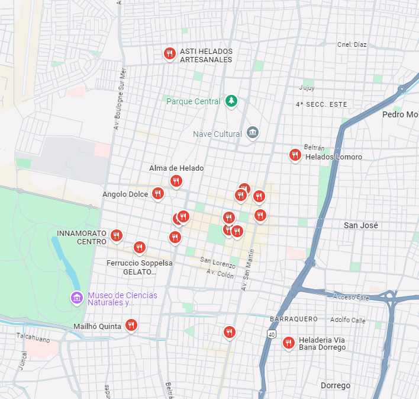
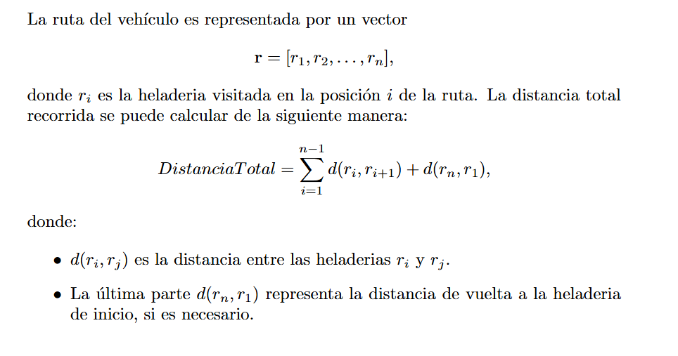
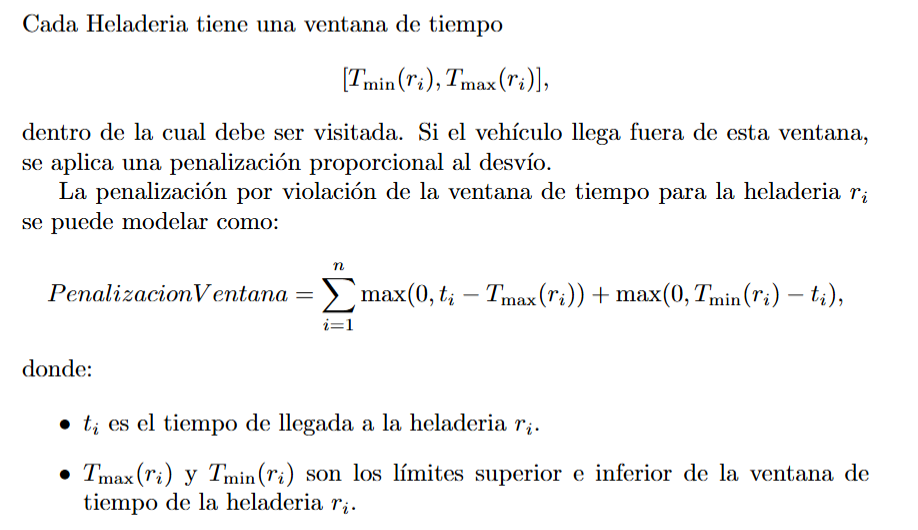
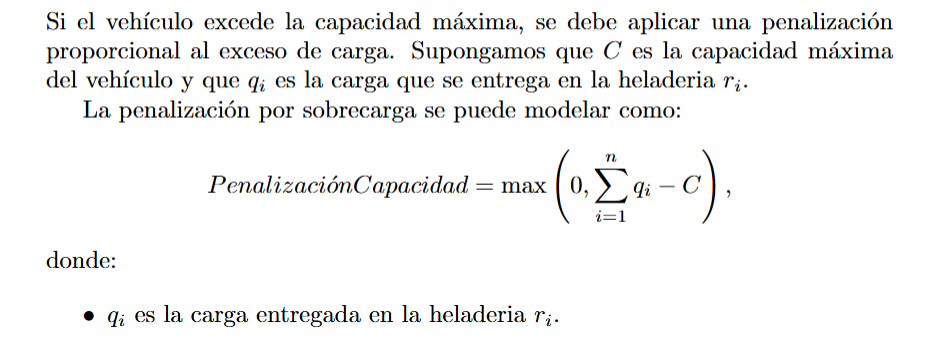
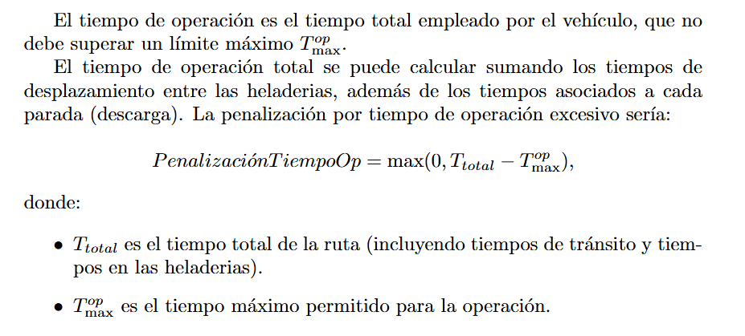
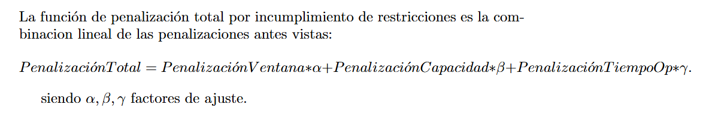
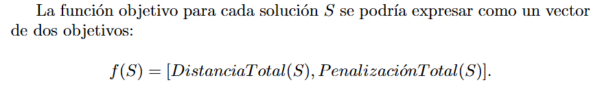

# Optimizacion de rutas para entregas a Heladerias

## Código de Proyecto
**Hela2**

## Descripción
Este proyecto tiene como objetivo el desarrollo de un algoritmo genético (AG) para optimizar las rutas de entrega dentro de un sistema logístico de heladerías. Se busca generar rutas eficientes teniendo en cuenta varios factores como la distancia, las ventanas de tiempo, la capacidad de los vehículos y el horario de circulacion del vehiculo.

## Integrantes
Giovanni Azurduy,
Gabriel Lopez Romero

### Objetivos del Proyecto
Desarrollar un algoritmo genético que genere rutas óptimas para un conjunto de entregas donde se buscara:
- Minimizar la distancia de las rutas generadas.
- Cumplir con las ventanas de tiempo.
- Demanda total atendida por el vehiculo no exceda su capacidad.
- Tiempo que pasa fuera de su depósito no debe exceder su capacidad de tiempo. 

### Deseable
- El vehiculo puede restablecer su stock pasando por cualquier depósito. (implementar mas depositos)

(En caso de poder implementar el uso de mas de un vehiculo)
- Minimizar el número de vehículos 
- Determinar qué clientes deben ser atendidos por cada vehiculo desde cada depósito

### Alcance
El proyecto se enfocará en un conjunto de datos representativo de un sistema de entrega ficticio; sin embargo, si se obtienen los datos necesarios, es posible adaptarlo a un escenario real.

### Limitaciones
- El algoritmo se evaluará solo en escenarios simulados.
  
## Justificación
Se emplea el uso de la programacion Evolutiva debido:
1. **Exploración de un Gran Espacio de Soluciones**: El TSP, y más aún con restricciones, tiene un espacio de soluciones muy amplio. La programación evolutiva es útil para explorar múltiples rutas de forma paralela, buscando combinaciones óptimas de manera más efectiva que con métodos de optimización exacta.

2. **Adaptabilidad a Restricciones Complejas**: Los algoritmos evolutivos pueden adaptarse bien a múltiples restricciones, como los horarios de apertura y tiempos de descarga, sin tener que modificar drásticamente la estructura del algoritmo. Se puede incluir estas restricciones en la función de fitness, penalizando soluciones que violen los límites de horario.

3. **Optimización Multiobjetivo**: Los algoritmos genéticos son especialmente útiles para problemas multiobjetivo y pueden ayudarte a encontrar soluciones balanceadas entre los distintos factores.

4. **Flexibilidad de Operadores Genéticos**: Operadores como el cruce y la mutación son personalizables, y puedes ajustarlos a la necesidad del problema, permitiendo una exploración más amplia y diversificada del espacio de búsqueda.

### Función Fitness
La función de fitness determinará qué tan buena es una solución (una secuencia de rutas). Tendrá en cuenta lo siguiente:

Funcion objetivo 1 - Minimizar la distancia total recorrida

Funcion Objetivo 2 - Minimizar el incumplimiento de penalizaciones

Penalizaciones:
- Penalizacion por incumplimiento de ventana de tiempo : Si el vehiculo llega fuera de la ventana de tiempo de cualquier cliente, la solución debe penalizarse.

- Penalizacion por capacidad maxima del vehiculo: Se asegura de que la carga total que transporta el vehiculo en cualquier momento no exceda su capacidad máxima.

- Penalizacion por tiempo de operacion: Asegúrate de que el tiempo que el vehiculo pasa fuera del depósito no exceda un límite máximo.

#### Si se resuelve como una sola funcion objetivo
Se realiza una combinacion lineal entre la funcion de distancia maxima y la de penalizacion con factores de ajusta para ponderar la relevancia de cada uno

#### Si se emplea multiobjetivo

### Metricas
#### Objetivo
El valor de la función objetivo debe ser lo más bajo posible o se busca cuando no disminuya demasiado durante las iteraciones, para verificar si está convergiendo.

#### Multiobjetivo
Al ser multiobjetivo se llega a un punto donde una solucion no puede ser mejorara sin emporar otra (Frontera de Pareto) 
- Hypervolume 

### Algoritmos candidatos a implementar
1. NSGA-II (Non-dominated Sorting Genetic Algorithm II)
2. MOGA (Multi-Objective Genetic Algorithm)
3. MOACO (Multi-Objective Ant Colony Optimization)

en caso de no ser multiobjetivo se implementara ACO (Ant Colony Optimization)

## Incorporacion Trafico (Deseable)
A la hora de implementar el trafico, se haria de manera dinamica en base horarios (el trafico varia conrespecto a la hora situada), con la ayuda de alguna api de uso publico .

Donde se puede emplear alguno de estos dos metodos para poder llevarlo acabo:

1. **Modificar la Función de Fitness**: Al hacerlo, se puede incluir una penalización por tráfico que aumente el "costo" de rutas que pasen por zonas con alta congestión. Esto impactaria directamente en cómo el algoritmo evalúa cada ruta, penalizando las rutas con tráfico.

Ventaja : es simple no agrega mas complejidad a la hora de realizar el algoritmo ya que lo agregamos como penalizacion. (Sea Objetivo o Multiobjetivo)

Desventaja : penalizar la funcion fitness "puede" no llegar a influir lo suficiente en la genearcion de nuevas , dificultando la exploración de rutas alternativas menos congestionadas.

2. **Incluir el Tráfico en el Algoritmo Genético**: Aquí se deberia ajustar los operadores genéticos para favorecer rutas que eviten las áreas de alta congestión. Por ejemplo, hacer que las mutaciones reduzcan la probabilidad de elegir rutas congestionadas o que el cruzamiento prefiera combinaciones de rutas menos afectadas por el tráfico.

Ventaja : otorga flexibilidad a la hora de buscar rutas optimas

Desventaja : Hay que modificar el algoritmo, incrementando la complejidad de este

### Detalle a tener encuenta
Ambas opciones aumentan la carga computacional pero de poder llevarse acabo tendriamos
soluciones mas precisas , ya que podria adaptarse a las horas de maxima congestion (horas pico).

## Listado de actividades a realizar
1. Leer Bibliografia y estudiar los conceptos de la resolucion de problemas multiobjetivo (7 dias)
2. Preparación de datos de entrada (clientes, depósitos, vehículos, capacidades, ventanas de tiempo, etc.). (7 dias)
3. Desarrollo del algorito evolutivo. (5 dias)
4. Pruebas y Ajuste de Parámetros. (3 dias)
5. Documentación y Presentación de Resultados (3 dias)
6. Desarrolo de Presentacion e informe final (4 dias)

#### Total de dias estimados : 29 dias

### Representación visual:

| Actividad                                    | Duración | Inicio | Día 1 | Día 2 | Día 3 | Día 4 | Día 5 | Día 6 | Día 7 | Día 8 | Día 9 | Día 10 | Día 11 | Día 12 | Día 13 | Día 14 | Día 15 | Día 16 | Día 17 | Día 18 | Día 19 | Día 20 | Día 21 | Día 22 | Día 23 | Día 24 | Día 25 | Día 26 | Día 27 | Día 28 | Día 29 |
|----------------------------------------------|----------|--------|-------|-------|-------|-------|-------|-------|-------|-------|-------|--------|--------|--------|--------|--------|--------|--------|--------|--------|--------|--------|--------|--------|--------|--------|--------|--------|--------|--------|--------|
| Leer Bibliografía y estudiar conceptos       | 7 días   | Día 1  | █     | █     | █     | █     | █     | █     | █     |       |       |        |        |        |        |        |        |        |        |        |        |        |        |        |        |        |        |        |        |        |
| Preparación de datos de entrada              | 7 días   | Día 8  |       |       |       |       |       |       |       | █     | █     | █      | █      | █      | █      | █      |        |        |        |        |        |        |        |        |        |        |        |        |        |        |
| Desarrollo del algoritmo evolutivo           | 5 días   | Día 15 |       |       |       |       |       |       |       |       |       |        |        |        |        |        | █      | █      | █      | █      | █      |        |        |        |        |        |        |        |        |        |
| Pruebas y ajuste de parámetros               | 3 días   | Día 20 |       |       |       |       |       |       |       |       |       |        |        |        |        |        |        |        |        |        |        | █      | █      | █      |        |        |        |        |        |        |
| Documentación y presentación de resultados   | 3 días   | Día 23 |       |       |       |       |       |       |       |       |       |        |        |        |        |        |        |        |        |        |        |        |        | █      | █      | █      |        |        |        |
| Desarrollo de presentación e informe final   | 4 días   | Día 26 |       |       |       |       |       |       |       |       |       |        |        |        |        |        |        |        |        |        |        |        |        |        |        |        | █      | █      | █      | █      |

## Bibliografía
Introduction to Evolutionary Computing J.E. Smith.
Capitulos : 7,8,12,13

Algoritmos MultiObjetivos
https://pymoo.org/algorithms/moo

Ant Colony Optimization for Multi-objective
Optimization Problems 
https://hal.science/hal-01502167/document
