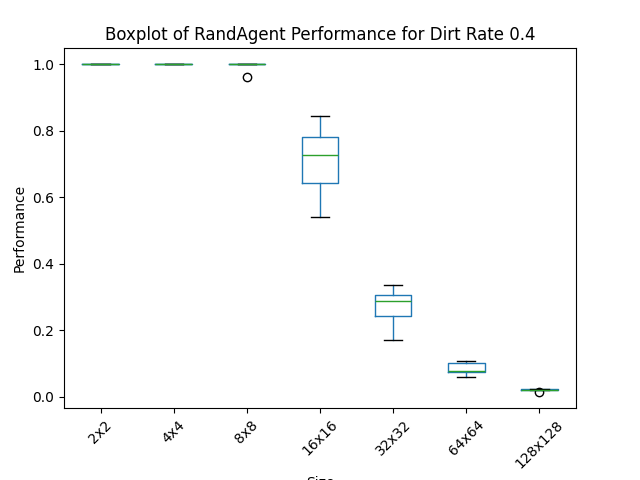

# Informe Roomba

---

## Introducción

El problema presentado establece un entorno de dimensiones variables (2x2, 4x4, ... , 128x128), en el cual existen casillas que contienen basura. Nuestro agente, llamado ***Roomba***, debe limpiar esta basura en un tiempo determinado. Tiene 1000 vidas, las cuales se van drenando a medida que la aspiradora se mueve. Por cada basura limpiada, Roomba ganará un punto.

Realizaremos una simulación por cada escenario posible, diez veces en cada uno, y analizaremos los resultados.

---

## Marco teórico

Se nos plantean dos tipos de agente:

- **Agente reflexivo simple**: Sus acciones están dadas por una serie de reglas preestablecidas. Tiene un rango de visión acotado, al que llamaremos *percepción*, el cual lo ayuda a tomar decisiones. No tiene memoria.

- **Agente aleatorio**: Se mueve de manera completamente aleatoria. En este caso, la única regla preestablecida es limpiar si se encuentra en una casilla que contiene basura.

Tienen ciertas características fundamentales para su funcionamiento: 

- Pueden moverse horzontal y verticalmente, mas no diagonalmente.

- Pueden no hacer nada.

- Su *percepción* está dada por sus 9 casillas adyacentes, incluyendo la actual.

Estos se medirán en entornos iguales para cada combinación. Los entornos tienen las siguientes características:

- Tamaño fijo y establecido.

- La cantidad de celdas sucias está dada por el "*dirt_rate*", el cual es un número entre 0 y 1 que indica la proporción de estas respecto al total de casillas existentes.

- La localización de la basura es desconocida.

- La localización inicial del agente es desconocida.

- A partir de su creación, no se vuelve a modificar.

---

## Diseño experimental

Los experimentos fueron realizados en condiciones justas y equitativas para que los resultados sean transparentes. Los entornos utilizados son todas las combinaciones posibles entre los tamaños (2x2, 4x4, 8x8, 16x16, 32x32, 64x64, 128x128) y los *dirt_rate* (0.1, 0.2, 0.4, 0.8), los cuales serán recorridos diez veces por cada una de ellas. La simulación concluye si se limpia toda la basura o si el agente "*muere*".

La medida de desempeño utilizada está dada por la siguiente fórmula:

$$
c = \text{ Cantidad de basura limpiada } \\
t = \text{ Cantidad total de casillas } \\

[0.75cm]P = \frac{t-c}{t}
$$

***P*** simboliza la proporción de basura limpiada respecto a la cantidad total de celdas existentes.

---

## Análisis y discusión de resultados

A continuación, veremos gráficamente los resultados de las simulaciones. Los resultados en forma de tabla para el [agente reflexivo simple](https://github.com/gabichulas/ia-uncuyo-2024/blob/main/tp2-agentes-racionales/ref_agent_results.csv) y el [aleatorio](https://github.com/gabichulas/ia-uncuyo-2024/blob/main/tp2-agentes-racionales/rand_agent_results.csv) pueden ser visualizados en su totalidad en los enlaces provistos.

Primeramente, veremos una comparación entre ciertos resultados, tomando como variable a analizar el índice ***P*** previamente definido, dados ciertos entornos.

En este caso, los resultados son idénticos. En la gran mayoría de casos, para ambos agentes, en entornos 8x8 toda la basura es eliminada. De hecho, para los entornos 2x2 y 4x4 pasa exactamente lo mismo. Ahora veremos los cambios:

Ahora, podemos ver una **notable** diferencia de rendimiento. El agente aleatorio es bastante menos eficaz que el reflexivo simple, dado que el último tiene como regla visitar y limpiar las celdas que contengan basura siempre que sea posible, maximizando su *performance*. 

Además podemos notar una clara diferencia en el escalonamiento de resultados. En el agente reflexivo simple, los resultados van mejorando a medida que el *dirt_rate* va creciendo, ya que es más probable que Roomba se encuentre basura. Al contrario, el agente aleatorio tiene un comportamiento muy similar independientemente de la cantidad de basura en el entorno, y, claramente, no posee ningún tipo de escalonamiento en su gráfico.

A continuación, veremos los gráficos para el entorno mas grande, 128x128, notando el mismo comportamiento, pero con resultados menos eficaces para ambos casos.

Para concluir con los gráficos, veremos gráficamente de qué manera se dispersan los resultados con respecto a los posibles tamaños de los entornos, dado un *dirt_rate* específico:

Podemos notar, por ejemplo, un rendimiento significativamente mayor para el agente reflexivo simple principalmente entre los entornos 16x16, 32x32 y 64x64. Los resultados están mucho menos dispersos y están bastante mas cerca de 1. 

Por otro lado, podemos observar una mayor dispersión en el entorno de 128x128 para el agente reflexivo simple, lo que significa que hubo uno que otro agente con un rendimiento mucho mejor y peor que el resto. Esto es mucho menos probable que pase con el agente aleatorio, debido a la falta de reglas y la carencia de *percepción*.

A continuación veremos algunos gráficos más, en el que observaremos los mismos patrones, pero con diferencias contundentes.

---

## Conclusión

A partir de los resultados presentados, podemos concluir que el ***agente reflexivo simple*** es ampliamente superior a su adversario. Esto era algo que podríamos esperar, ya que este tiene la capacidad de observar su entorno y tomar decisiones a partir de ello, lo que lo ayuda a minimizar la cantidad de vidas malgastadas. 

También, podemos observar una clara tendencia del agente reflexivo a tener un rendimiento mucho mayor para *dirt_rate* más grandes, lo cual no corresponde para el agente aleatorio. Este último suele tener comportamientos muy similares independientemente del *dirt_rate* dado.

Por último, una conclusión un poco obvia y previsible es que, mientras más pequeño el entorno, mejores serán los resultados. Esto se debe a que la cantidad de basura depende directamente del tamaño del entorno, y Roomba tiene siempre la misma cantidad de vidas, por lo que tendrá menos chances de recorrer y limpiar el mapa a medida que este crezca.

