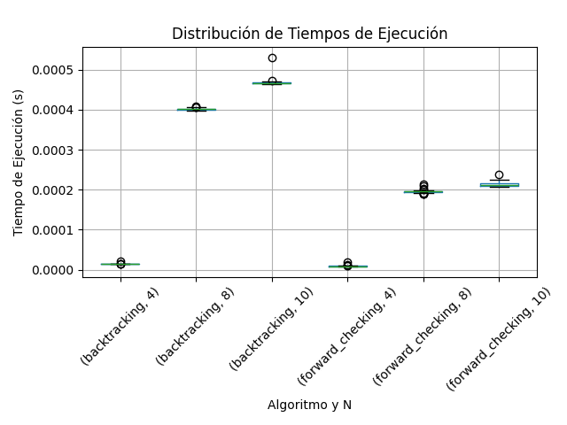
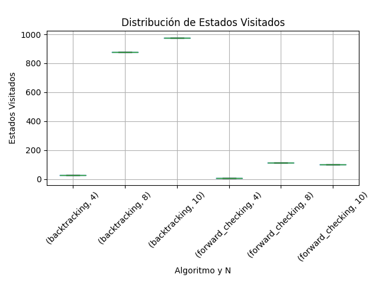
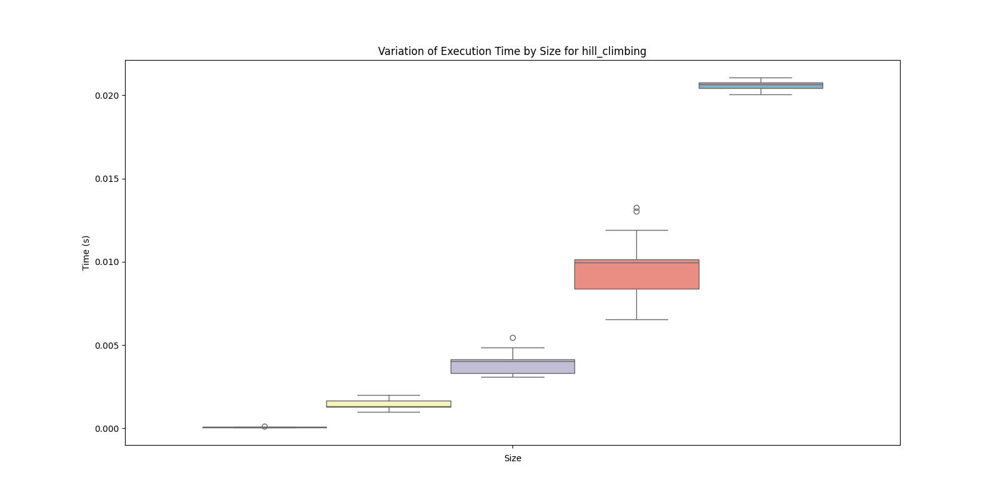
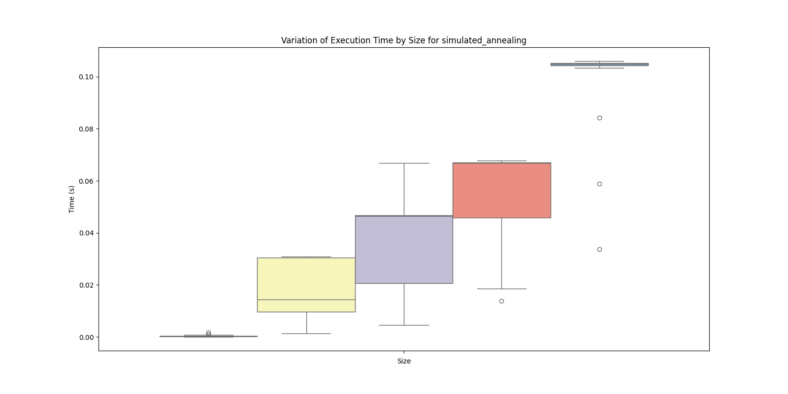

# Ejercicio 1

Para resolver el problema de Sudoku mediante CSP, debemos definir lo siguiente:

- **Variables**: casillas del tablero (generalmente 81).
- **Dominio**: enteros del 1 al 9.
- **Restricciones**: no pueden haber dos números iguales en la misma fila, columna o subcuadrícula 3x3.

---

# Ejercicio 2

En este problema de coloración de mapas, cada región debe ser coloreada de forma que ninguna región vecina comparta el mismo color. Consideramos:
- $R$ como rojo.
- $B$ como azul.
- $G$ como verde.
- Los colores iniciales son $WA = R$ y $V = B$.

Comenzamos con una lista de todos los arcos que representan las restricciones de adyacencia entre las regiones:

Lista inicial: (SA-WA), (SA-V), (NT-WA), (NT-SA), (Q-SA), (Q-NT), (NSW-Q), (NSW-SA), (NSW-V)

En cada iteración, se remueve un arco de la lista y se verifica la consistencia entre los dominios de las variables. Si un valor del dominio de una variable no tiene correspondencia en el dominio de la otra variable que cumpla con la restricción, dicho valor se elimina. Si esto deja a una variable sin valores posibles, se concluye que el problema no tiene solución.

### Detalle del proceso:

1. **Arco (SA, WA)**:
   - Se elimina $R$ del dominio de $SA$ porque $WA$ es $R$.
   - Se añaden de nuevo a la lista los arcos de $SA$ con sus otros vecinos: (SA, NT), (SA, Q), (SA, NSW), (SA, V).

2. **Arco (SA, V)**:
   - Se elimina $B$ del dominio de $SA$ porque $V$ es $B$.
   - El dominio de $SA$ queda con el valor $G$.
   - Se añaden de nuevo a la lista los arcos de $SA$ con sus otros vecinos: (SA, NT), (SA, Q), (SA, NSW).

3. **Arco (NT, WA)**:
   - Se elimina $R$ del dominio de $NT$ porque $WA$ es $R$.
   - Se añaden de nuevo a la lista los arcos de $NT$ con sus otros vecinos: (NT, SA), (NT, Q).

4. **Arco (NT, SA)**:
   - Se elimina $G$ del dominio de $NT$ porque $SA$ es $G$.
   - El dominio de $NT$ queda con el valor $B$.
   - Se añaden de nuevo a la lista los arcos de $NT$ con sus otros vecinos: (NT, WA), (NT, Q).

5. **Arco (Q, SA)**:
   - Se elimina $G$ del dominio de $Q$ porque $SA$ es $G$.
   - Se añaden de nuevo a la lista los arcos de $Q$ con sus otros vecinos: (Q, NT), (Q, NSW).

6. **Arco (Q, NT)**:
   - Se elimina $B$ del dominio de $Q$ porque $NT$ es $B$.
   - El dominio de $Q$ queda con el valor $R$.
   - Se añaden de nuevo a la lista los arcos de $Q$ con sus otros vecinos: (Q, NSW), (Q, NT).

7. **Arco (NSW, Q)**:
   - Se elimina $R$ del dominio de $NSW$ porque $Q$ es $R$.
   - Se añaden de nuevo a la lista los arcos de $NSW$ con sus otros vecinos: (NSW, SA), (NSW, V).

8. **Arco (NSW, SA)**:
   - Se elimina $G$ del dominio de $NSW$ porque $SA$ es $G$.
   - Se añaden de nuevo a la lista los arcos de $NSW$ con sus otros vecinos: (NSW, V).

9. **Arco (NSW, V)**:
   - Se elimina $B$ del dominio de $NSW$ porque $V$ es $B$.
   - Esto deja a $NSW$ sin valores en su dominio.
   - Dado que el dominio de $NSW$ está vacío, el algoritmo determina que no hay solución posible para el problema.

El proceso concluye al encontrarse con una variable ($NSW$) que queda sin valores posibles, lo que indica que no es posible asignar colores a todas las regiones de forma que se cumplan las restricciones de adyacencia. Por lo tanto, el algoritmo devuelve `falso`.

---

# Ejercicio 3

La complejidad en este caso es de $O(ad^2)$, siendo $a$ = número de arcos y $d$ = tamaño máximo de los dominios de las variables. Esto se debe a que al no haber ciclos en el grafo se facilita mucho el recorrido del algoritmo.

---

# Ejercicio 4

Al utilizar contadores para cada arco $(X_k,X_i)$, que registran cuántos valores de $X_i$ son consistentes con cada valor de $X_k$​, se puede actualizar estos contadores de manera eficiente cuando se elimina un valor de $X_i$​. Si un contador llega a cero, el valor correspondiente de $X_k$ se elimina y solo así el arco se reinserta en la cola, evitando revisiones innecesarias. Esto permite que el algoritmo planteado logre la arco-consistencia en un tiempo total de $O(n^2d^2)$, ya que reduce el número de revisiones a lo mínimo indispensable.

---

# Ejercicio 5

La 2-consistencia asegura que para cada par de variables conectadas por una restricción, cada valor de una variable tiene al menos un valor compatible en la otra.

En un árbol, la ausencia de ciclos significa que una vez asignados los valores a las variables, no habrá inconsistencias cíclicas. Si una variable es consistente con su vecino (nodo hijo), esa consistencia no se verá afectada por asignaciones posteriores.

Para demostrar la n-consistencia en un árbol, elegimos un nodo "raíz" y aplicamos la 2-consistencia en cada nodo durante un recorrido descendente. Esto garantiza que cualquier valor asignado a una variable tendrá al menos un valor compatible en sus nodos hijos. Dado que no hay ciclos, las asignaciones en otros subárboles no interferirán con las consistencias establecidas. Por lo tanto, la 2-consistencia es suficiente para asegurar la n-consistencia en un CSP basado en árboles.

# Ejercicios 6 y 7

Luego de las simulaciones solicitadas, podemos observar lo siguiente:

Este gráfico nos indica que Forward Checking fue ampliamente superior a Backtracking. Esto podemos verlo, fundamentalmente, en la diferencia entre los resultados de ambos algoritmos, pero también en la diferencia de tiempo de ejecución entre tableros con 8 y 10 reinas de cada uno de ellos, destacando que, también, FC es mucho mejor.

Aquí tenemos un caso muy similar, donde, de hecho, en las resoluciones de Forward Cheking se recorrieron, en promedio, más estados para 8 reinas que para 10.

De nuevo, Forward Checking es muchísimo mas eficiente.

Ahora, compararemos nuestros resultados con Hill Climbing y Simulated Annealing:

En cuanto a tiempo de ejecución vemos una mejora considerable de parte de los algoritmos vistos en este tp. También podemos observar una menor dispersión en nuestras cajas. Esto indica que las nuevas soluciones son mucho mejores.

# Conclusión

Ambas implementaciones de CSP (Backtracking y Forward Checking) fueron ampliamente mejores que las vistas en el anterior tp, pero nuestra principal conclusión es que hay un claro ganador: Forward Checking. Fue mucho más rápido que el resto, y hasta tuvo mejores resultados, comparando con los suyos, con n más grandes, lo cual no es habitual, pero dependiendo el caso puede ser muy beneficioso.