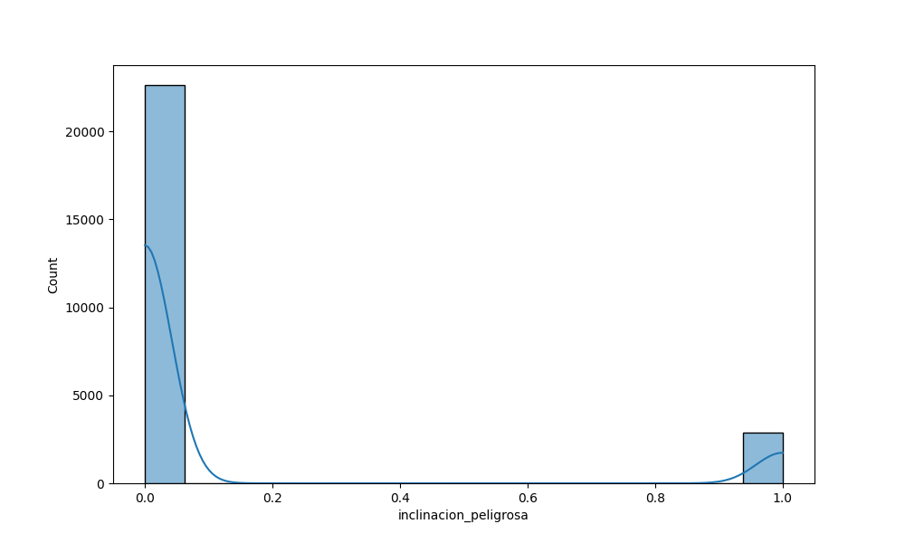
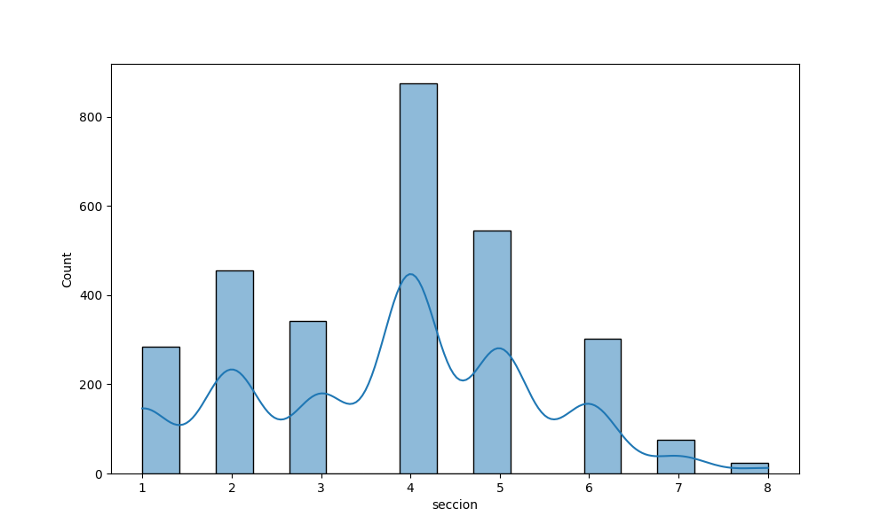
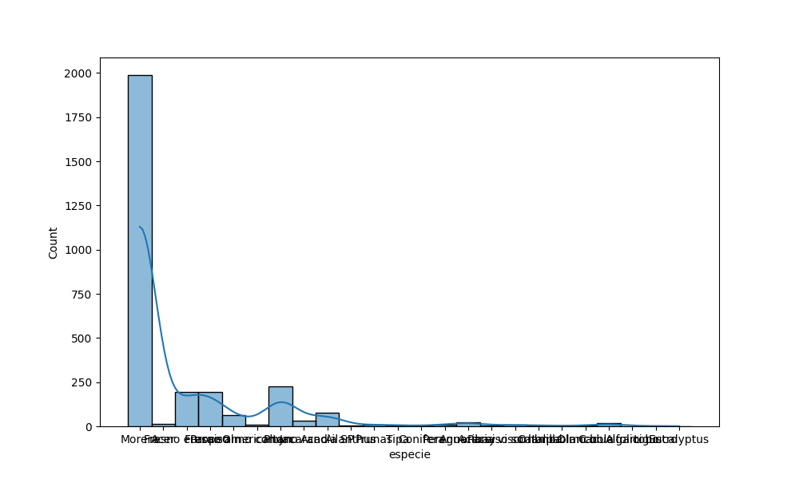

# EDA

## Ejercicio 2

### Inciso A

La distribución de esta variable es bastante favorable hacia los árboles sin inclinación peligrosa. Podemos verlo fácilmente en el siguiente histograma:

### Inciso B

Si. La sección 4 es bastante más peligrosa que el resto, seguidade las secciones 5 y 2.

### Inciso C

Aunque el gráfico no sea tan claro, podemos observar que el árbol "**Morera**" es mucho más peligroso que todas las demás especies.

## Ejercicio 3

### Incisos A y B

Las imágenes son *demasiadas*, por lo que se pueden visualizar en las correspondientes carpetas.

