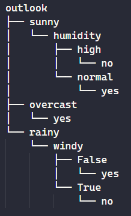

## Resultados

Los resultados obtenidos fueron:

## Resumen sobre decisiones de tipo real

Para este tipo de datos, los árboles de decisión dividen los datos en función de umbrales específicos:

- División por umbrales: Se evalúan múltiples puntos de corte para cada feature y se selecciona el que mejor separe los datos en función de ciertas métricas, como la reducción de varianza.

- Poda de árboles: Para evitar que el modelo overfittee, se pueden podar los árboles. Esta poda puede tratarse de detener el crecimiento del árbol antes de volverse muy complejo (pre-pruning) o podar el árbol después de que se haya construido (post-pruning)

- Robustez a outliers: Los árboles de decisión son resistentes a valores extremos, por lo que no tendríamos problemas.